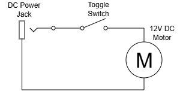

# Turbo Frother

Frustrated by my AA-battery-powered Milk Frother, I decided to build my own Frother using scrap 12V DC Motor, 3D Printed enclosure, and zip ties.

## Overview

I intended to power the Frother using 12V Power Adaptor. I didn't add an ESC or Motor Driver as I don't need to control the motor speed. However you can use a lower voltage power adaptor or motor for lower speeds. There is also a switch for quick ON/OFF if things go haywire.

## Schematic



## Hardware Specifications

### Main Components

| Component                        | Quantity |
| :------------------------------- | :------: |
| **12V Brushed Motor**            |    1     |
| **Toggle Switch**                |    1     |
| **DC Jack 5.5 x 2.5mm - Female** |    1     |
| **12V Power Adaptor**            |    1     |
| **PETG 3D Printer Filament - 150gr** | 1 |

### 3D Printed Enclosure

I've split the case into two parts so that I can assemble the motor, switch, and DC Jack inside it. The motor mount are designed specifically for my 12V DC Motor, so adjustment would be needed for smaller motors. There are tabs to hold the motor in place when spinning. I didn't design a screw hole so zip ties are used to hold everything together. It is recommended to print the round side facing the build plate, but you need to add brim and a little bit of support for good adhesion.

## Repository Structure
```
├── images/             # image assets
├── src/
│   └── STL/            # 3D Printable STL Files
└── README.md
```
